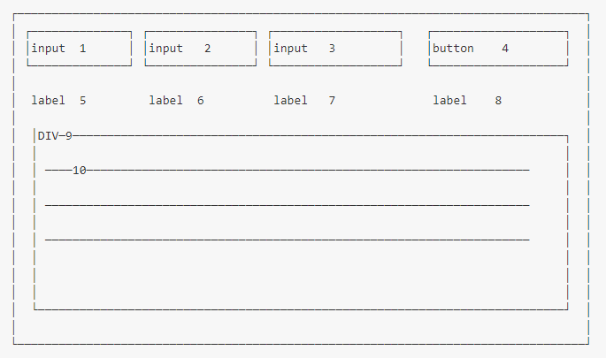

# CtrlHack. Тестовое задание Vue 2

## Цель

Разработать прототип решения для динамического обновления элементов веб-интерфейса с функцией протоколирования событий.

## Подготовка

За основу взять стандартный проект Vue 2 (создание через vue cli). Создать простейший интерфейс с элементами как на рисунке ниже:

Где:
1. поле ввода “Цена” (price)
2. поле ввода “Кол-во” (qty)
3. поле ввода “Сумма” (amount)
4. кнопка отправки данных
5. лейбл, который отображает значение поля “Цена” (1)
6. лейбл, который отображает значение поле “Кол-во” (2)
7. лейбл, который отображает значение поля “Сумма” (3)
8. лейбл, который отображает текущее состояние localStorage браузера
9. область, в которой отображается информация о возникших событиях
10. непосредственно информация возникающих событиях

Типы событий для области (9):
- изменение полей ввода (1,2,3)
- нажатие кнопки (4)
- получение результата после нажатия кнопки (4)

## Поведение

- Пользователь вносит значения в поля ввода (1,2,3) в любом порядке
- По мере изменения полей ввода осуществляется пересчёт значений полей ввода, при этом пересчитывается поле, которое менялось раньше двух других
- Лейблы (5,6,7) отображают текущие значения полей ввода
- При нажатии кнопки (4) в localStorage сохраняется информация о значении всех полей ввода, а также последовательный номер операции (nonce)
- Соответствующие события отображаются в области (9) в порядке “новое сверху”
- Лейбл (8) отображает текущее состояние localStorage в виде json

## Параметры реализации

- Обновления полей ввода при перерасчете осуществляются с debounce 300мс (не чаще одного раза в 300мс)
- Начальное значение номера операции nonce = 0
- При нажатии на кнопку (4):
  - результат возвращается с задержкой 1 секунда
  - если “Сумма” четное число, то данные сохраняются и возвращается сообщение “{success:true}”
  - если “Сумма” нечетное число, то данные не сохраняются и возвращается сообщение “{success:false}”
